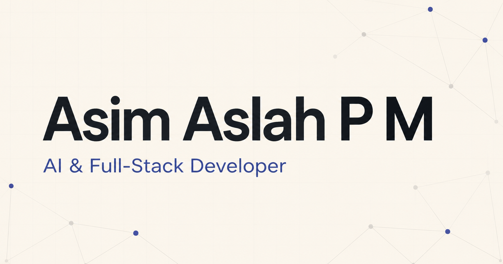

# Asim Aslah — Portfolio

Professional portfolio for **Asim Aslah P M**, an AI Full-Stack Developer building computer-vision, privacy-preserving AI, image-to-3D, and modern web applications.

[View the live portfolio](https://asim-portfolio.asimaslu7.workers.dev/)



## Highlights

- Responsive project case studies for Image-to-3D, DataVeil, Velora, and AI Virtual Keyboard
- BYTE portfolio assistant with verified, scripted answers and recruiter-focused shortcuts
- Interactive Mini Byte hero companion with theme switching and reduced-motion support
- Light and dark themes, optional interface sound, keyboard navigation, and responsive layouts
- Persistent portfolio ratings backed by Cloudflare D1
- SEO metadata, Open Graph imagery, sitemap, robots metadata, and accessible interaction states

## Technology

- React 19, Next.js 16, TypeScript, and vinext
- Vite and Tailwind CSS
- Cloudflare Workers, Assets, and D1
- Drizzle ORM
- Node.js test runner and ESLint

## Local development

Requirements:

- Node.js 22.13 or newer
- pnpm

```bash
pnpm install
pnpm dev
```

Open [http://localhost:3000](http://localhost:3000).

The portfolio pages run locally without additional secrets. The feedback API requires the Cloudflare D1 `DB` binding; without it, the local feedback section displays its unavailable state while the rest of the portfolio remains functional.

## Optional environment variable

Copy `.env.example` to `.env.local` when enabling Cloudflare Web Analytics:

```env
NEXT_PUBLIC_CLOUDFLARE_WEB_ANALYTICS_TOKEN=
```

Leave the value empty when analytics is not configured. Never commit real environment values.

## Commands

| Command | Purpose |
| --- | --- |
| `pnpm dev` | Start the local development server |
| `pnpm lint` | Run ESLint |
| `pnpm test` | Run the automated test suite |
| `pnpm build` | Create the production build |
| `pnpm start` | Start the built application locally |
| `pnpm db:generate` | Generate Drizzle database artifacts |

## Deployment

The production application is deployed as the `asim-portfolio` Cloudflare Worker. Its asset and D1 bindings are defined in `wrangler.jsonc`.

```bash
pnpm build
pnpm exec wrangler deploy
```

## Project structure

```text
app/          Routes, metadata, styles, and feedback API
components/   Portfolio interface and interactive components
data/         Verified profile and project content
db/           D1 schema and feedback persistence
drizzle/      Database migration artifacts
lib/          BYTE, feedback, theme, and Mini Byte logic
public/       Images, video, résumé, and social preview assets
tests/        BYTE, feedback, and Mini Byte tests
```

## Contact

- [GitHub](https://github.com/AsimAslah)
- [LinkedIn](https://www.linkedin.com/in/asim-aslah-pm-05906a222)
- [Email](mailto:asimaslu7@gmail.com)
